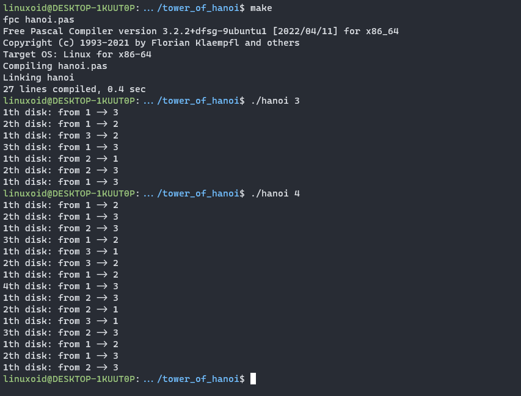

# Tower of Hanoi Solver

## What is it?
The Tower of Hanoi problem consists of 3 rods and ***N*** discs of different sizes. Roughly, the goal of the problem is to move the stack of discs from the leftmost rod to the rightmost rod. However, as all problems, some rules have to be followed:

+ We can only move one disc at a time
+ We can also only move a disc if it is the uppermost disc on a stack
+ Finally, we cannot place a larger disc on top of a smaller one. In other words, we will always need to have cone-shape towers

So, the simple example shown in the figure below.


We can see that **7** steps were required to solve this simple example. This corresponds to `2^n - 1`

You can try to solve this problem by yourself [here](https://www.mathsisfun.com/games/towerofhanoi.html).

## About Solver
You need to have **fpc (Free Pascal Compiler)** for compiling `hanoi.pas` file.

### Linux
```
sudo apt-get install fpc
```
### MacOS
```
sudo port install fpc
```
---
#### Compile and run program with
```
make
./hanoi N
```
where ***N*** is number of *discs*.

Result is like this


Delete the executable file with command
```
make clean
```
